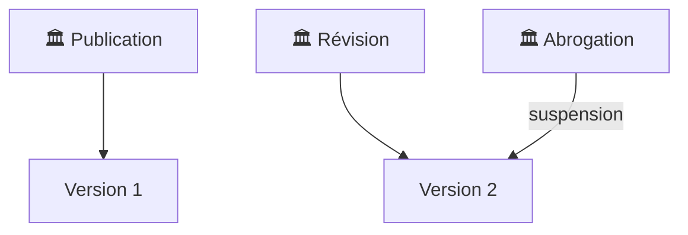

    

 

    <a href="https://github.com/registre-national-cee">
        Le projet
    </a>&nbsp;&nbsp;&nbsp;
    <a href="https://github.com/registre-national-cee/opendata">
        Données ouvertes
    </a>&nbsp;&nbsp;&nbsp;
    <a href="https://github.com/registre-national-cee/documentation">
        Documentation
    </a>&nbsp;&nbsp;&nbsp;
    <a href="https://github.com/registre-national-cee/api">
        API
    </a>&nbsp;&nbsp;&nbsp;
    <a href="https://github.com/registre-national-cee/app">
        Plateforme
    </a>

    <a href="https://github.com/registre-national-cee/fiches">
        Fiches d'opérations standardisées
    </a>&nbsp;&nbsp;&nbsp;
    <a href="https://github.com/registre-national-cee/bonifications">
        Bonifications
    </a>&nbsp;&nbsp;&nbsp;
    <a href="https://github.com/registre-national-cee/programmes">
        Programmes d'accompagnement
    </a>

 

# Registre national des Certificats d'Economies d'Energie - Fiches d'opérations standardisées

Données publiques des fiches d'opérations standardisées d'économies d'énergie définies dans le cadre du dispositif des Certificats d'Economies d'Energie (CEE).

## Schémas de données publiques

- id: Identifiant unique de la fiche au format CODEvVERSION
- secteur: Secteur d'application de la fiche
- sous_secteur: Sous secteur d'application de la fiche
- code: Code de la fiche
- nom: Nom de la fiche
- version: Version de l'arrêté
- date_debut: Date d'entrée en vigueur de la fiche ou de sa version
- date_fin: Date d'abrogation de la fiche ou sa version
- metropole: Application de la fiche sur le territoire métropolitain
- outre_mer: Application de la fiche sur le territoire ultra-marin

## Cycle de vie des données publiques

## Sources

- [Opérations standardisées d'économies d'énergie](https://www.ecologie.gouv.fr/politiques-publiques/operations-standardisees-deconomies-denergie)
